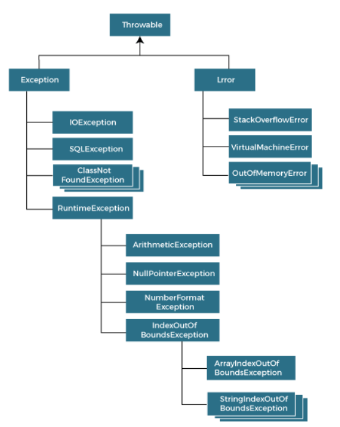

# Exception Handling in Java
The Exception Handling in Java is one of the powerful mechanism to handle the runtime errors so that the normal flow of the application can be maintained.
In this section, we will learn about Java exceptions, it's types, and the difference between checked and unchecked exceptions.

**What is Exception in Java?**
In Java, an exception is an event that occurs during the execution of a program that disrupts the normal flow of instructions. These exceptions can occur for various reasons, such as invalid user input, file not found, or division by zero. When an exception occurs, it is typically represented by an object of a subclass of the java.lang.Exception class.

**Advantage of Exception Handling**
The core advantage of exception handling is to maintain the normal flow of the application. An exception normally disrupts the normal flow of the application; that is why we need to handle exceptions. Let's consider a scenario:
statement 1;  
statement 2;  
statement 3;  
statement 4;  
statement 5;//exception occurs  
statement 6;  
statement 7;  
statement 8;  
statement 9;  
statement 10;  
Suppose there are 10 statements in a Java program and an exception occurs at statement 5; the rest of the code will not be executed, i.e., statements 6 to 10 will not be executed. However, when we perform exception handling, the rest of the statements will be executed. That is why we use exception handling in Java.

***Hierarchy of Java Exception classes***

The java.lang.Throwable class is the root class of Java Exception hierarchy inherited by two subclasses: Exception and Error. The hierarchy of Java Exception classes is given below:


### Types of Java Exceptions
In Java, exceptions are categorized into two main types: checked exceptions and unchecked exceptions. Additionally, there is a third category known as errors. Let's delve into each of these types:
*1.Checked Exception*
*2.Unchecked Exception* (both are built in exceptions)
*3.Error*

#### 1. Checked Exceptions
Checked exceptions are the exceptions that are checked at compile-time. This means that the compiler verifies that the code handles these exceptions either by catching them or declaring them in the method signature using the throws keyword. Examples of checked exceptions include:
**IOException**: An exception is thrown when an input/output operation fails, such as when reading from or writing to a file.
**SQLException**: It is thrown when an error occurs while accessing a database.
**ParseException**: Indicates a problem while parsing a string into another data type, such as parsing a date.
**ClassNotFoundException**: It is thrown when an application tries to load a class through its string name using methods like Class.forName(), but the class with the specified name cannot be found in the classpath.
#### 2. Unchecked Exceptions (Runtime Exceptions)
Unchecked exceptions, also known as runtime exceptions, are not checked at compile-time. These exceptions usually occur due to programming errors, such as logic errors or incorrect assumptions in the code. They do not need to be declared in the method signature using the throws keyword, making it optional to handle them. Examples of unchecked exceptions include:
**NullPointerException**: It is thrown when trying to access or call a method on an object reference that is null.
**ArrayIndexOutOfBoundsException**: It occurs when we try to access an array element with an invalid index.
**ArithmeticException**: It is thrown when an arithmetic operation fails, such as division by zero.
**IllegalArgumentException**: It indicates that a method has been passed an illegal or inappropriate argument.

#### 3. Errors
Errors represent exceptional conditions that are not expected to be caught under normal circumstances. They are typically caused by issues outside the control of the application, such as system failures or resource exhaustion. Errors are not meant to be caught or handled by application code. Examples of errors include:
**OutOfMemoryError**: It occurs when the Java Virtual Machine (JVM) cannot allocate enough memory for the application.
**StackOverflowError**: It is thrown when the stack memory is exhausted due to excessive recursion.
**NoClassDefFoundError**: It indicates that the JVM cannot find the definition of a class that was available at compile-time.
Understanding the different types of exceptions in Java is crucial for writing robust and reliable code. By handling exceptions appropriately, you can improve the resilience of your applications and provide better user experiences.hierarchy of exception handling

### Java Exception Keywords
Java provides five keywords that are used to handle the exception. The following table describes each.
**try:** The "try" keyword is used to specify a block where we should place an exception code. It means we can't use try block alone. The try block must be followed by either catch or finally.
**catch:** The "catch" block is used to handle the exception. It must be preceded by try block which means we can't use catch block alone. It can be followed by finally block later.
**finally:** The "finally" block is used to execute the necessary code of the program. It is executed whether an exception is handled or not.
**throw:** The "throw" keyword is used to throw an exception.
**throws:** The "throws" keyword is used to declare exceptions. It specifies that there may occur an exception in the method. It doesn't throw an exception. It is always used with method signature.

### The try-catch Block
One of the primary mechanisms for handling exceptions in Java is the try-catch block. The try block contains the code that may throw an exception, and the catch block is used to handle the exception if it occurs. Here's a basic example:

```try {  
// Code that may throw an exception 
} catch (ExceptionType e) {  
// Exception handling code  
}

### Handling Multiple Exceptions
You can handle multiple types of exceptions by providing multiple catch blocks, each catching a different type of exception. This allows you to tailor your exception handling logic based on the specific type of exception thrown. Here's an example:

try {  
// Code that may throw an exception  
} catch (IOException e) {  
// Handle IOException  
} catch (NumberFormatException e) {  
// Handle NumberFormatException  
} catch (Exception e) {  
// Handle any other exceptions  
}  

### The finally Block
In addition to try and catch, Java also provides a finally block, which allows you to execute cleanup code, such as closing resources, regardless of whether an exception occurs or not. The finally block is typically used to release resources that were acquired in the try block. Here's an example:

try {  
// Code that may throw an exception  
} catch (Exception e) {  
// Exception handling code  
} finally {  
// Cleanup code  
}  

### Common Scenarios of Java Exceptions
There are given some scenarios where unchecked exceptions may occur. They are as follows:

1) A scenario where ArithmeticException occurs
   If we divide any number by zero, there occurs an ArithmeticException.

public class ArithmeticExceptionExample {  
   public static void main(String[] args) {  
   int dividend = 10;  
   int divisor = 0;  
   try {  
   int result = dividend / divisor; // Division by zero  
   System.out.println("Result: " + result);  
   } catch (ArithmeticException e) {  
   System.out.println("Error: Division by zero is not allowed.");  
   // Additional error handling code can be added here  
   }  
   }  
   }  
Output:
Error: Division by zero is not allowed.

2) A scenario where NullPointerException occurs
If we have a null value in any variable, performing any operation on the variable throws a NullPointerException.

public class NullPointerExceptionExample {  
public static void main(String[] args) {  
String str = null; // Initializing a String variable to null  
try {  
int length = str.length(); // Attempting to call a method on a null reference  
System.out.println("Length of the string: " + length);  
} catch (NullPointerException e) {  
System.out.println("Error: Null reference encountered.");  
// Additional error handling code can be added here  
}  
}  
}  
Output:
Error: Null reference encountered.

3) A scenario where NumberFormatException occurs
   If the formatting of any variable or number is mismatched, it may result into NumberFormatException. Suppose we have a string variable that has characters; converting this variable into digit will cause NumberFormatException.

public class NumberFormatExceptionExample {  
public static void main(String[] args) {  
String str = "abc"; // Initializing a String with non-numeric characters  
try {  
int num = Integer.parseInt(str); // Attempting to parse a non-numeric string to an integer if str="132" then it'd be correct
System.out.println("Parsed number: " + num);  
} catch (NumberFormatException e) {  
System.out.println("Error: Unable to parse the string as an integer.");  
// Additional error handling code can be added here  
}  
}  
}  
Output:
Error: Unable to parse the string as an integer.

4) A scenario where ArrayIndexOutOfBoundsException occurs
   When an array exceeds to it's size, the ArrayIndexOutOfBoundsException occurs. there may be other reasons to occur ArrayIndexOutOfBoundsException. Consider the following statements.

public class ArrayIndexOutOfBoundsExceptionExample {  
public static void main(String[] args) {  
int[] numbers = {1, 2, 3, 4, 5}; // Initializing an array with 5 elements  
try {  
int index = 10; // Accessing an index that is out of bounds  
int value = numbers[index]; // Attempting to access an element at an invalid index  
System.out.println("Value at index " + index + ": " + value);  
} catch (ArrayIndexOutOfBoundsException e) {  
System.out.println("Error: Index is out of bounds.");  
// Additional error handling code can be added here  
}  
}  
}  
Output:
Error: Index is out of bounds.