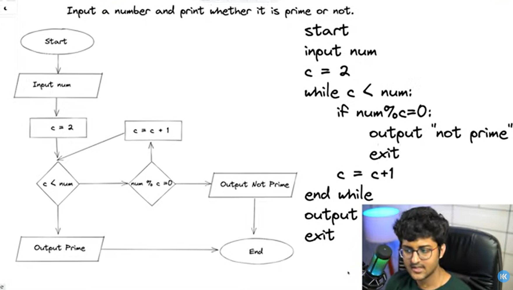

### how to format .md file
[Click here](https://medium.com/@saumya.ranjan/how-to-write-a-readme-md-file-markdown-file-20cb7cbcd6f)

# Types of languages
1.Procedural        2.Functional        3.ObjectOriented

**1.Procedural language**
The basic construct of procedural programming is blocks of code known as procedures or routines.
Procedures contain sequence instructions that specify a computational step carried out upon execution.

**2.Functional language**
The basic units of functional programming are functions.
In this paradigm, functions are first-class citizens of the language.
We can assign a function to a variable, pass it as an argument or return it from a function just like a regular variable.
That means a function can be defined and invoked in any context just as much as a variable can.
The idea is to remove the difference between functions and data.

**3.ObjectOriented language**
The main building block of OOP are objects that represent a mental model of an actual object in the real world.
An object has an internal state of attributes (or properties) and a group of associated actions (or behavior)
that implements a mental model of an object in the real world.
For example, we can model a car as an object that can start, accelerate, and stop.
A car also has a model name and speed, which are represented in its attributes.
The main idea behind OOP is to communicate with objects through their public attributes.

## static vs dynamic languages
**Static languages:-**
Perform type checking at compile time, meaning before the code is executed.
This means that static languages will not compile if there are errors,
and data types are fixed and cannot change during runtime.
Examples of static languages include Java, C++, and C#

**Dynamic languages:-**
Perform type checking at runtime, meaning while the code is being executed.
This means that dynamic languages can compile even if they contain errors,
and variables can change their data type during runtime.
Examples of dynamic languages include Python, Ruby, and JavaScript
---------------------------------------------------------------------------------------------------------------------------

*flowchart and pseudocode of prime_number program*