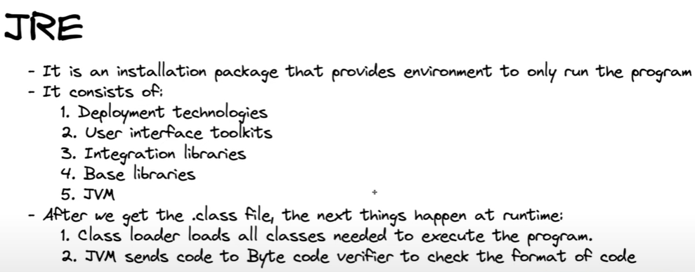

## Role of compiler in languages c,c++ and java
__C and C++:__
The compiler translates source code into machine code, performing multiple stages of analysis, 
optimization, and linking. The resulting machine code is specific to the target hardware.

__Java:__ 
The compiler translates source code into bytecode, an intermediate form that is platform-independent. 
The bytecode is executed by the JVM, which provides portability across different systems.

---------------------------------------------------------------------------------------------------------

---------------------------------------------------------------------------------------------------------

---------------------------------------------------------------------------------------------------------

---------------------------------------------------------------------------------------------------------

---------------------------------------------------------------------------------------------------------

---------------------------------------------------------------------------------------------------------

---------------------------------------------------------------------------------------------------------

---------------------------------------------------------------------------------------------------------

*know the latest jdk version*
[jdk_download](https://www.oracle.com/in/java/technologies/downloads/)

### Primitive data types:[datatype(size in bytes)]
int(4):*stores whole numbers from -2,147,483,648 to 2,147,483,647 i.e, ( total: 2^(4\*8)=>2^32=>4,294,967,296  range:-((2^32)/2) to ((2^32)/2)-1)  )*   
char(2):*stores a single character/letter or ASCII values*  
float(4):*stores fractional numbers sufficient for storing 6-7 decimal digits*  
byte(1):*stores whole numbers from -128 to 127*  
double(8):*stores fractional numbers sufficient for storing 15 decimal digits*  
short(2):*stores whole numbers from -32,768 to 32,767*  
long(8):*stores total: 2^(8\*8)=>2^64 range:-((2^64)/2) to ((2^64)/2)-1)*  
Boolean(1/8 i.e, 1bit):*stores true or false values*  

there is unsigned data types in java
byte can hava values from -127 to 128
byte b=129 //would through an error 
byte b=(byte)(129) //o/p:-127 coz of overflow(rotation)
for arithmetic operations :
byte a=100,b=100;
byte c=a+b;//will through en error coz a+b will lead to integer and the type mentioned is byte
//to work it we should type cast
byte c=(byte)(a+b);//same for other arithmetic operations

### Non-Primitive data types: 
Primitive types are predefined (already defined) in Java. Non-primitive types are created by the programmer and is not defined by Java (except for String).  
Non-primitive types can be used to call methods to perform certain operations, while primitive types cannot.  
A primitive type always has a value, while non-primitive types can be null.  
A primitive type starts with a lowercase letter, while non-primitive types starts with an uppercase letter.
Examples:Strings
Arrays 
Classes

### Type promotion in java-expressions
Java automatically promotes each byte, short, or char operand to int when evaluating an expression.  
If one operand is long, float or double the whole expression is promoted to long, float, or double respectively.  

### int vs Integer
In Java, int and Integer are both used to represent integer values, but they differ in terms of their nature and usage:

1. Type
   int: A primitive data type that stores numeric values directly in memory.
   Integer: A wrapper class in the java.lang package that encapsulates an int value as an object.
2. Memory Usage
   int: Consumes less memory as it directly stores the numeric value.
   Integer: Consumes more memory since it is an object and includes additional metadata.
3. Default Values
   int: Default value is 0.
   Integer: Default value is null because it is an object.
4. Nullability
   int: Cannot hold null. It's a primitive, so it must always have a valid numeric value.
   Integer: Can hold null, making it useful for cases where a value might be absent.
5. Autoboxing and Unboxing
   Autoboxing: Automatically converts int to Integer.
   Unboxing: Automatically converts Integer to int.<br>
   int primitiveInt = 10;<br>
   Integer wrapperInt = primitiveInt;  // Autoboxing<br>
   int anotherInt = wrapperInt;        // Unboxing<br>
6. Usability in Collections
   int: Cannot be used in Java collections like ArrayList directly.
   Integer: Can be used in collections since it is an object.<br>
   // Using Integer in a collection<br>
   ArrayList<Integer> list = new ArrayList<>();<br>
   list.add(10);  // Autoboxing<br>
7. Methods and Utility
   int: Does not have methods.
   Integer: Provides utility methods (e.g., parseInt(), valueOf(), toString()).
   int num = Integer.parseInt("123");
   String str = Integer.toString(456);
8. When to Use?
   Use int for performance-critical tasks or when null values are not required.
   Use Integer when working with Java Collections, APIs that require objects, or when null needs to be represented.

### More about wrapper classes
A wrapper class in Java is a class that encapsulates (wraps) a primitive data type into an object. It allows primitive types (like int, char, etc.) to behave like objects and provides utility methods to work with these primitives.
For example, the Integer class is the wrapper for the int primitive type.<br>
Why Do We Need Wrapper Classes?<br>
Object-Oriented Nature of Java: Java treats everything as an object except primitive types. Wrapper classes provide a way to use primitives in object-oriented contexts.<br>
Use in Collections: Java's collections (like ArrayList, HashMap) work with objects, not primitives. Wrapper classes bridge this gap.<br>
Utility Methods: Wrapper classes provide helpful methods to convert between data types, parse strings, compare values, etc.<br>
Autoboxing and Unboxing: Wrapper classes support autoboxing (automatic conversion of primitives to objects) and unboxing (automatic conversion of objects to primitives).<br>

_*Wrapper Classes for Primitive Types*_<br>
```
PrimitiveType	WrapperClass	ExampleUsage
byte	        Byte	        Byte b = Byte.valueOf(10);
short	        Short	        Short s = 100;
int	        Integer	        Integer i = 42;
long	        Long	        Long l = 999L;
float	        Float	        Float f = 3.14f;
double	        Double	        Double d = 2.718;
char	        Character	Character c = 'A';
boolean	        Boolean	        Boolean b = true;
```

**Key Features of Wrapper Classes**
1. Conversion Between Primitives and Strings: Wrapper classes provide methods to convert primitives to strings and vice versa.
```
int number = 10;
String str = Integer.toString(number);  // int to String
int num = Integer.parseInt(str);       // String to int
```
2. Utility Methods: Wrapper classes provide many utility methods.
```
// Example with Integer
Integer num = Integer.valueOf(50);  // Creates an Integer object
System.out.println(num.compareTo(40));  // Compares values
System.out.println(Integer.max(10, 20));  // Finds the max of two numbers
```
3. Autoboxing and Unboxing: Java automatically converts between primitives and their corresponding wrapper classes.
```
int primitive = 5;
Integer wrapped = primitive;  // Autoboxing
int unwrapped = wrapped;      // Unboxing
```
4. Immutability: Wrapper class objects are immutable, meaning once created, their value cannot be changed.

_Common Methods in Wrapper Classes_<br>
valueOf(String s): Converts a string to a wrapper object.<br>
parseInt(String s): Parses a string and returns the corresponding primitive.<br>
toString(): Converts a primitive or wrapper object to a string.<br>
compareTo(): Compares two wrapper objects.<br.
equals(Object o): Checks if two objects are equal.<br>
